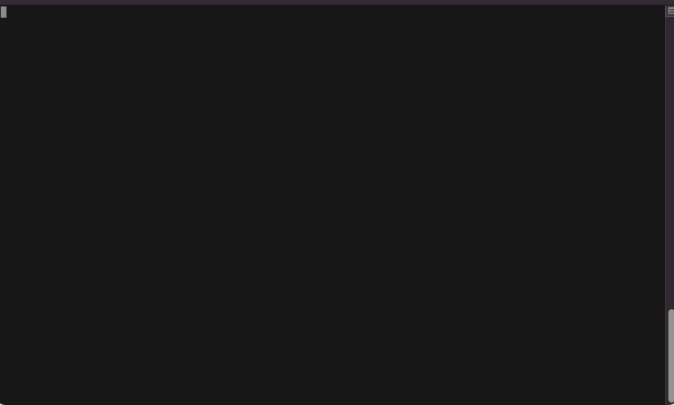

This repo is used for a skeleton app. Highly opinionated with [poetry](https://python-poetry.org/), [loguru](https://github.com/Delgan/loguru) & [typer](https://typer.tiangolo.com/).



## Steps from scratch

Create a new poetry project:
```bash
$ poetry new MyApp
```

Rename README.rst file
```bash
$ cd MyApp
$ mv README.rst README.md
```

Fix  `pyproject.toml`
```python
readme = "README.md"

[tool.poetry.dev-dependencies]
pytest = "^7.1"
```

Also add a section in `pyproject.toml` to run your app directly from terminal without calling python
```python
[tool.poetry.scripts]
myapp = "myapp.main:app"
```

Update poetry, add typer & loguru
```bash
$ poetry update
$ poetry add typer
$ poetry add loguru
```

Create [`main.py`](./myapp/main.py) and also [`sub.py`](./myapp/sub.py).

Test the script
```bash
$ exit
$ poetry shell
$ myapp --help
```
